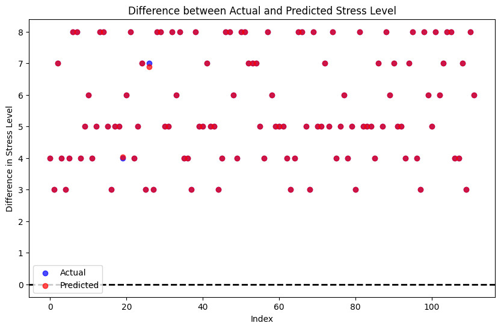
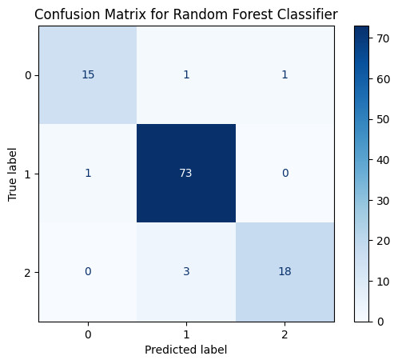

# Predicting Stress and Sleep Disorders Using Health and Lifestyle Data
- This project explores **machine learning for mental health**, 
- specifically predicting **human stress levels** from physiological and behavioral signals.  
- It was developed as part of **Introduction to Machine Learning** at **IIT Palakkad**.

---

## Project Overview  
Stress is a critical factor affecting mental and physical well-being. Our project leverages **supervised learning techniques** to classify stress levels (e.g., low, medium, high) based on features extracted from sensor and questionnaire data.  

Currently the project consists of two major tasks. 
1. A classification task (Sleep Disorder)
2. A regression task (Stress level)

A point to note that, these tasks are done independent of one another.
i.e, during the model training for ```stress level```, ```sleep disorder``` is not used as a feature and vice versa.

Key Highlights:  
- Preprocessing of real-world physiological datasets (EDA, heart rate, etc.)  
- Feature engineering and EDA for stress-related markers  
- Training and evaluation of multiple ML models  
- Comparative analysis of accuracy, precision, recall, and F1-score  
- Documentation of pipeline for reproducibility  

---

## Results  
- Regression
    - Achieved **1.00 r2-score** and **0.0001 mean squared error**  with XGBOOST (regressor).
    - Other results for XGBOOST regressor
    

- Classification
    - Achieved **94% accuracy** with Random Forest (classifier).
    - Other results for Random Forest classifier
    

- Notable improvement over baseline methods.  

- Final conclusions
1. Sleep disorder is highly affected by BMI category
2. Stress level is extremely affected by level of sleep 

---

## Tech Stack  
- **Languages**: Python (NumPy, Pandas, Matplotlib)  
- **ML Libraries**: scikit-learn, XGBoost  
- **Notebooks & Visualization**: Jupyter, Seaborn  
- **Collaboration & Docs**: GitHub, Google Docs  

---

## Repository Structure  
.
├── data            # Data used for training (thanks to kaggle)
│   ├── Sleep_health_and_lifestyle_dataset.csv
│   └── Sleep_health_and_lifestyle_dataset_part_2.csv
├── docs            # Documentation for the project
│   └── ML Project.pdf
├── notebooks       # Jupyter notebooks for visualization
│   ├── endsem.ipynb
│   ├── midsem.ipynb
│   └── test.ipynb
├── README.md           # Readme
├── results             # Results of the training
├── requirements.txt    # Project dependencies
└── src                 # Main part of the code

---

## Getting Started  

- Clone the repository and install dependencies:  
``` bash
git clone https://github.com/VISHNU-SHREERAM/ML-Project
cd ML-Project
```

- NOTE: It is recommended that a virtual environment is used
``` bash
python3 -m venv venv
source venv/bin/activate
```

- Installing dependencies
``` bash
pip install -r requirements.txt
```

## Working results of the Data Analysis and training
- We have worked in a jupyter notebooks
- All the python code used in the notebooks is in the ```src/``` directory
- There is one jupyter file which has all the EDA and training of the model.
- Please select the appropriate python environment and run the jupyter notebook to see results


## Documentation
- Detailed methodology and results can be found in our project [report](docs/ML Project.pdf).

## Team
- [Vishnu Shreeram M P](https://github.com/VISHNU-SHREERAM) 
- [Bhupathi Varun](https://github.com/cvbshcbad)
- [Bhogaraju Shanmukha Sri Krishna](https://github.com/wanderer3519)
